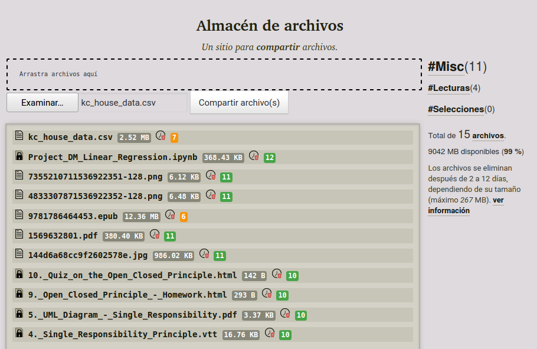
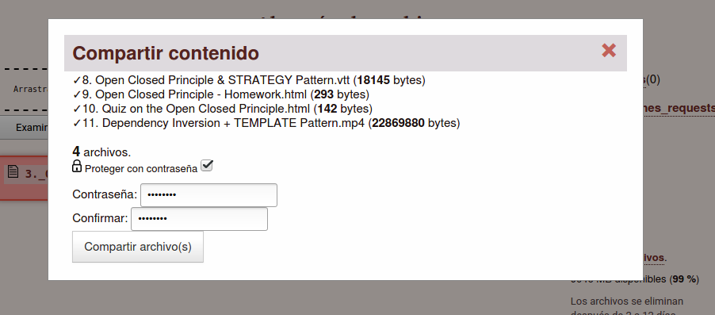

* [Castellano](#es)
* [English](#en)
----
<h3 id="es">Almacén de archivos</h3>

- Repositorio Original: https://notabug.org/strysg/botadero
- Mirror github: https://github.com/strymsg/almacenArchivos

Servicio web centralizado para compartir archivos en una red local o internet.

Un directorio público donde cualquiera puede subir archivos y estos se pueden descargar libremente.





Para ahorrar espacio de almacenamiento, los archivos se borran después de un número ajustable de tiempo (días, minutos o segundos) y también se evita la posiblidad de subir archivos duplicados usando algoritmos para obtener digestos sha1, md5, sha256, etc. 

Entre las funcionalidades que se pueden ajustar están:

- [x] Intervalo de borrado.
- [x] Almacenamiento máximo para archivos.
- [x] Almacenamiento máximo por tamaño de archivo.
- [x] Intervalo de borrado por tamaño de archivos.
- [x] Selección de algoritmo para digestos.
- [x] Comprobación acelerada de digestos.
- [x] Protección de archivos usando passwords.
- [x] Ajuste de unidad de tiempo.
- [x] Selección de estilos de apariencia.
- [ ] Buen soporte para dispositivos móviles.

Esta aplicación no guarda datos sobre quién sube los archivos, licencia **AGPL**.

#### Instalación ####

- Despliegue con nginx: [docs/INSTALL.es.md](docs/INSTALL.es.md)
- Se utiliza python3 con el micro framework Flask, se puede instalar con los siguientes pasos:

##### Para desarrollo #####

    # descargar el repositorio
    git clone https://notabug.org/strysg/botadero
	cd botadero
	# crear entorno virtual python 3
	virtualenv --python=python3 venv
	# activar entorno virtual
	. venv/bin/activate
	# instalar dependencias
	pip install -r rquirements.txt
	# variables de entorno
	export FLASK_APP=botadero.py
	export FLASK_ENV=development
	# ejecutar en modo desarrollo
	flask run

    # ejecutar pruebas (desarrollo)
	pytest

La aplicación necesita que se ejecute el script `cronjobs.py` que se encarga de **actualizar** el tiempo restante de los archivos y eliminarlos. Es recomendable agregar la ejecución de este script como tarea programada, en sistemas UNIX por ejemplo agregando una entrada en /etc/crontab.

```
*/1 *   * * *   user    cd /home/user/alamcenArchivos; export FLASK_ENV=production;venv/bin/python3 cronjobs.py >> cronjobs.log 2>&1
```
<h3 id="en">Archive store</h3>

- Repositorio Original: https://notabug.org/strysg/botadero
- Mirror github: https://github.com/strymsg/almacenArchivos

Centralized web server to share files on a local network or over the internet. 

A public directory where anyone can upload files and so they can be freely downlaoded.


To save storage, files are deleted after an adjustable number of days and file duplication is avoided by using sha1, md5, sha256, etc. digests.

Some customizable features are:

- [x] File deletion interval.
- [x] Maximun file storage size.
- [x] Maximun file size for files.
- [x] Deletion interval per file size.
- [x] Verbosity level to log files.
- [x] Digest algorithm selection.
- [x] Accelerated digest.
- [x] File protection using password.
- [x] Time unit adjustment.
- [ ] Good support for mobile devices.

This application does not store data about who upload files, **AGPL** License.

#### Install ####

- Deploy with nginx: [docs/INSTALL.es.md](docs/INSTALL.es.md)
- It uses python3 and micro framework Flask, can be installed following:
	
##### For development #####

    # download project
    git clone https://notabug.org/strysg/botadero
	cd botadero
	# create python 3 virtual environment
	virtualenv --python=python3 venv
	# activate it
	. venv/bin/activate
	# install dependencies
	pip install -r rquirements.txt
	# environment variables
	export FLASK_APP=botadero.py
	export FLASK_ENV=development
	# run development mode
	flask run

    # testing
    pytest

The aplication requires the script `cronjob.py` to be executed, this *updates* the files ramaining time and also removes them if necesary. It is recomended to make the execution of this script a cronjob, on UNIX system for instance adding to /etc/crontab.

```
*/2 *    * * *   user    export FLASK_ENV=production; /home/user/almacenArchivos/venv/bin/python3 /home/user/almacenArchivos/cronjobs.py
```

